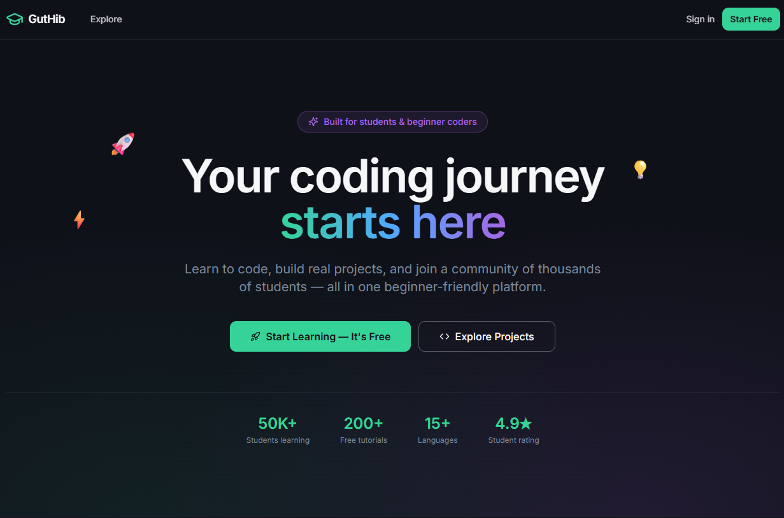
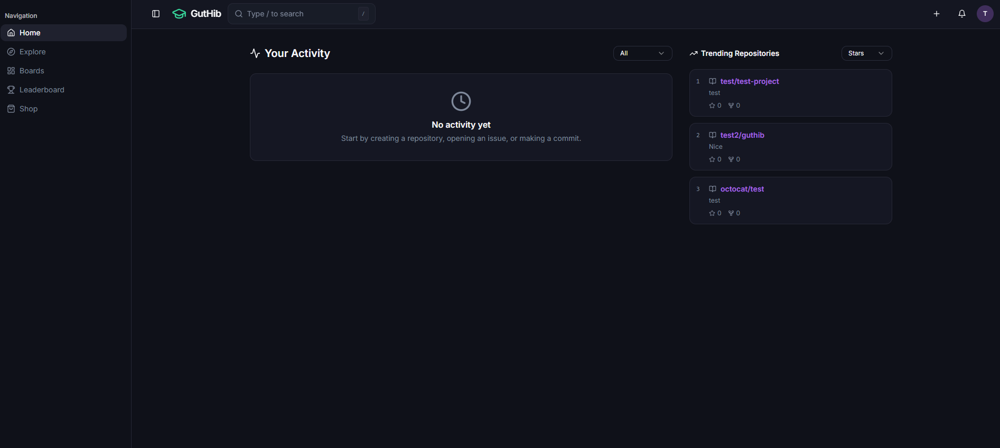
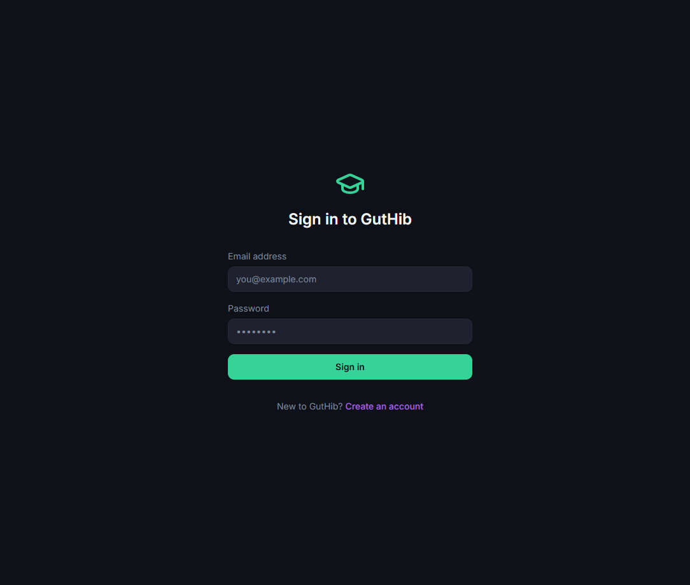
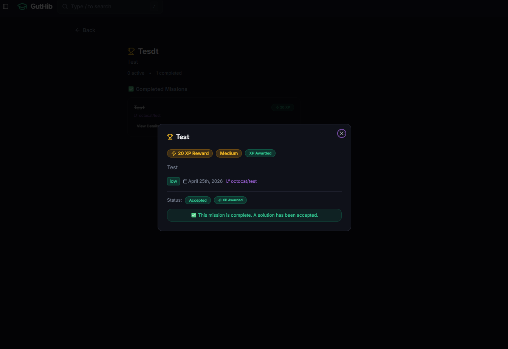
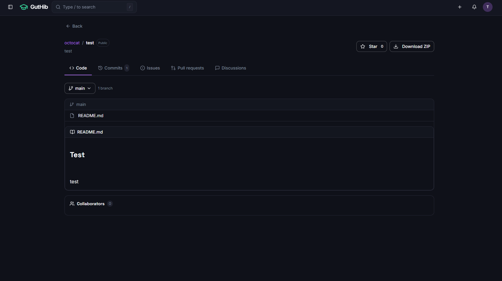
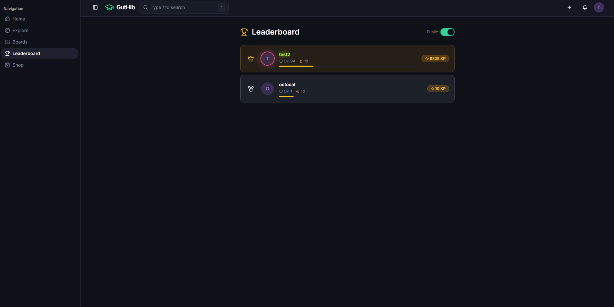
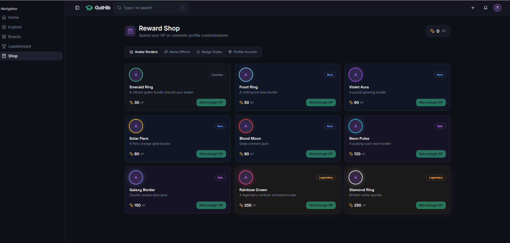
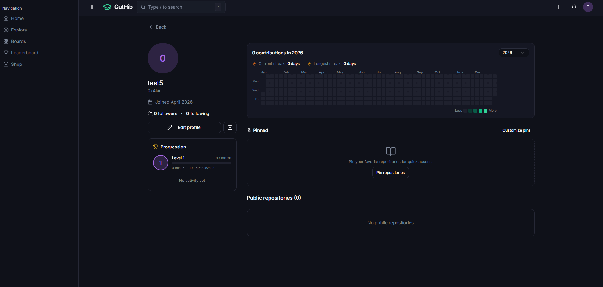

# 🚀 Guthib V1

A gamified task management platform where productivity meets play. Complete tasks,
level up, unlock rewards, and track your activity streaks — built for people who
want to make getting things done actually fun.
Built with React (Vite), Tailwind CSS, and Supabase using a serverless architecture and deployed on Vercel.

## 🌐 Live Demo

👉 [https://guthib-v1.vercel.app/](https://guthib-v1.vercel.app/)

---

## 📸 Preview

### 🏠 Landing Page


### 🏠 Home Page


### 🔐 Authentication Page


### 🗂️ Task Board


### 🐙 GitHub-like Activity System


### 🏆 Leaderboard


### 🛒 Shop System


### 👤 Profile Page


---

## ✨ Features

### 🔐 Authentication System
- Secure login and signup via Supabase Auth
- Persistent sessions
- Protected routes

### 🗂️ Task Board
- Create, update, and delete tasks
- Organized workflow: **To Do → In Progress → Done**
- Responsive and interactive UI

### 🐙 GitHub-like Activity System
- Contribution-style activity tracking
- User activity history visualization
- Engagement-based system

### 🏆 Gamified Ecosystem
- XP and leveling system
- Leaderboard rankings
- Reward-based progression

### 🛒 Shop System
- Redeem XP for rewards
- Virtual economy
- Unlockable items and perks

### 👤 Profile System
- Editable user profile
- User stats dashboard
- Customization options

### ☁️ Backend (Serverless)
- Supabase integration: Authentication, PostgreSQL, Storage, and Real-time updates

---

## 📱 Responsive Design

- Fully mobile-friendly
- Optimized for tablets and phones
- Adaptive layout for all screen sizes

---

## 🛠️ Tech Stack

### Frontend
- React (Vite)
- Tailwind CSS
- React Router DOM
- React Hook Form + Zod
- TanStack React Query
- Radix UI / shadcn/ui
- Recharts
- Lucide React Icons

### Backend (Serverless)
- Supabase — Auth, PostgreSQL, Storage, Real-time subscriptions

### Deployment
- Vercel

---

## 📦 Installation

### 1. Install dependencies

```bash
npm install
```

### 2. Environment Setup

Create a `.env` file in the root directory:

```env
VITE_SUPABASE_PROJECT_ID=your_supabase_project_id
VITE_SUPABASE_PUBLISHABLE_KEY=your_supabase_publishable_key
VITE_SUPABASE_URL=your_supabase_url
```

> Get these from: **Supabase → Project Settings → API**

### 3. Run development server

```bash
npm run dev
```

App runs at `http://localhost:8080/`

---

## 🧪 Build & Preview

```bash
# Production build
npm run build

# Preview build locally
npm run preview
```

---

## 🔄 Git Workflow

If Git rejects your push:

```bash
npm install
git pull origin master --rebase
git push origin master
```

---

## 🚀 Deployment (Vercel)

1. Push to GitHub:

```bash
git add .
git commit -m "update"
git push origin master
```

2. Go to [https://vercel.com](https://vercel.com) and import your repository.

3. Configure settings:
   - **Framework:** Vite
   - **Build Command:** `npm run build`
   - **Output Directory:** `dist`

4. Add environment variables:
   - `VITE_SUPABASE_URL`
   - `VITE_SUPABASE_ANON_KEY`

5. Deploy 🚀

---

## 📌 Future Improvements

- [ ] Real-time collaboration features
- [ ] Mobile app version
- [ ] AI-powered task suggestions
- [ ] Notification system
- [ ] Advanced analytics dashboard